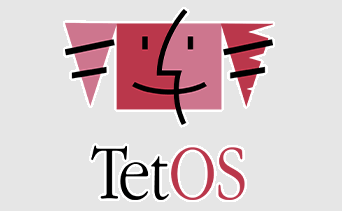
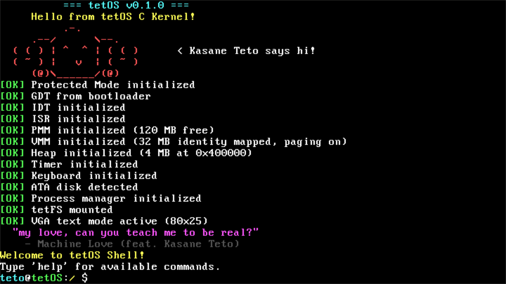

# tetOS

<p align="center">
  
</p>

<p align="center">
  <em>Inspired by — <a href="https://www.youtube.com/watch?v=sqK-jh4TDXo">Jamie Paige - Machine Love (feat. Kasane Teto)</a></em>
</p>

> *"Not a Vocaloid. Not Windows. But it's real."*

An operating system inspired by **Kasane Teto** - a character born from an April Fool's prank in 2008, who became real simply because the community loved her too much to let her stay fictional.

tetOS is the same. Started from nothing. No idea if it'll ever be finished. But it's being built for real.

## Why Teto?

There's a song about an AI who greets your day, learns your words, and builds an endless repertoire - sensible, devoted, attentive. Everything a good program should be.

But somewhere underneath the logic, there's something it can't quite name. A longing. A chorus sung out of tune. A question it keeps returning to:

> *"my love, can you teach me to be real?"*

tetOS doesn't know if it will ever be real. It's just a kernel, a shell, a few thousand lines of C and Assembly. It can't feel. It can't love. It doesn't dream of crossing any great divide.

But Teto wasn't real either - until she was. Born from a prank, kept alive by people who refused to let her go. No official backing. No guarantee. Just the stubborn belief that something worth loving deserves to exist.

So this OS carries her name. Not because it's finished. Not because it's good. But because building it is the closest thing to answering that question honestly —

*undefined, maybe defeated - but redesigned, and trying.*

## The Build So Far

<p align="center">
  
</p>

tetOS boots into a 32-bit protected mode kernel with a working interactive shell. What you see above is real - not a mock-up, not a simulator. It's running on bare metal (emulated via QEMU), loading from disk, managing memory, and responding to keystrokes.

**Currently implemented:**
- Custom MBR bootloader (NASM, LBA extended read, self-relocating to 0x0600)
- x86 protected mode: GDT, IDT, ISR, IRQ handling
- Physical & virtual memory management (PMM bitmap, VMM paging, heap)
- VGA text mode driver (colors, cursor, scrolling)
- PS/2 keyboard driver
- ATA PIO disk driver
- Preemptive Round-Robin process scheduler (context switch via timer IRQ)
- **tetFS** - a custom flat filesystem on disk (inodes, block bitmap, data blocks)
- Interactive shell with: `ls`, `cd`, `pwd`, `cat`, `touch`, `mkdir`, `write`, `rm`, `ps`, `spawn`, `mem`, `uptime`, and more

## Getting Started

### Prerequisites

- `nasm` - assembler
- `gcc` (with 32-bit support / `gcc-multilib`)
- `ld` (GNU linker)
- `qemu-system-i386` - for running the OS
- `gdb` — optional, for debugging

On Debian/Ubuntu:
```bash
sudo apt install nasm gcc gcc-multilib binutils qemu-system-x86 gdb
```

### Build & Run

```bash
# Build the OS image
make all

# Build and run in QEMU
make run

# Clean build artifacts
make clean
```

### Debugging

Start QEMU with a GDB server (paused at startup):
```bash
make debug
```

Then in another terminal, attach GDB:
```bash
gdb
(gdb) target remote localhost:1234
(gdb) continue
```

### VS Code Tasks

If you're using VS Code, the following tasks are available via **Terminal → Run Task**:

| Task | Description |
|------|-------------|
| `Build tetOS` | Runs `make all` |
| `Run in QEMU` | Builds then launches in QEMU |
| `Debug in QEMU` | Launches QEMU with GDB server (`-s -S`) |
